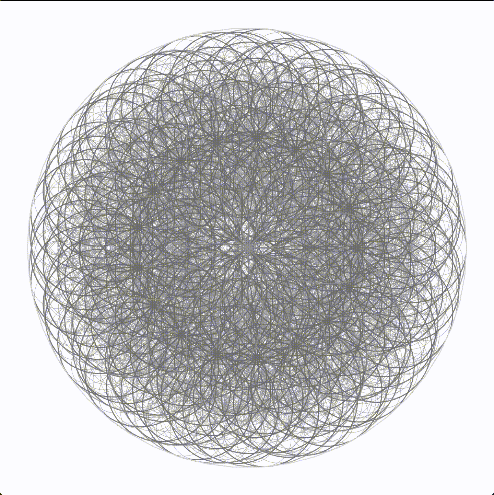

# Circle

Writing the circles recursively. The number of circles and color are chosen at random.

## User inputs

- Keyboard Input
  - 1
    - re-render the frame with animation
  - 2
    - re-render the frame with animation (in reverse order)
  - 3
    - re-render the frame with animation (in shuffled order)
  - 4
    - re-render the frame with animation (in reverse and shuffled order)
  - 5
    - re-render the frame immediately
  - 6
    - re-render the frame immediately (in reverse order)
